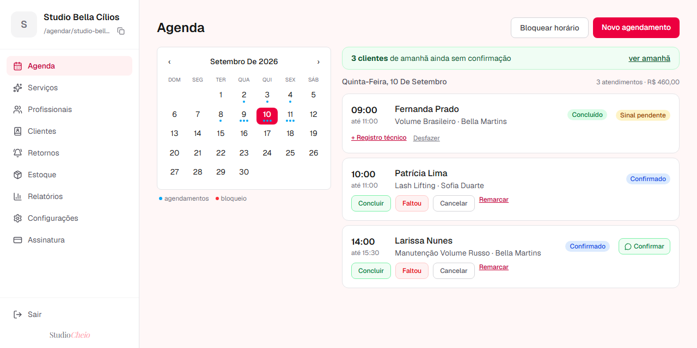
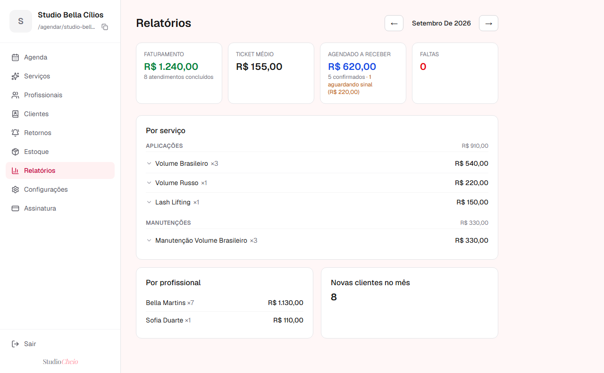
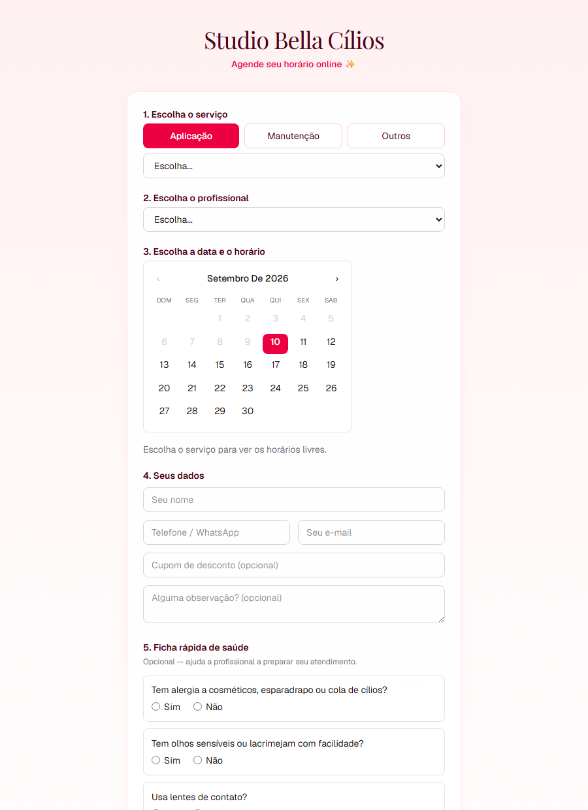
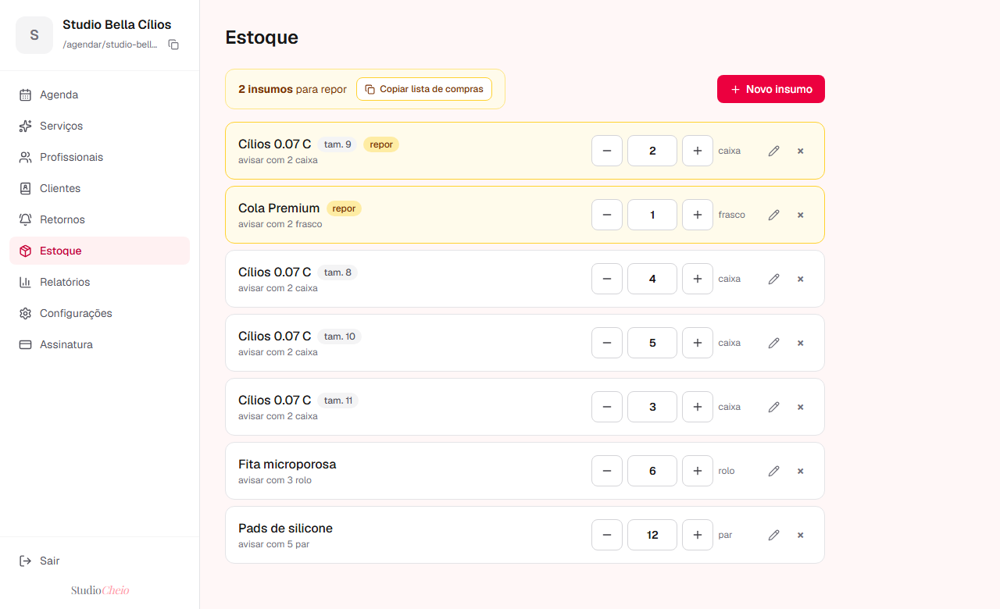
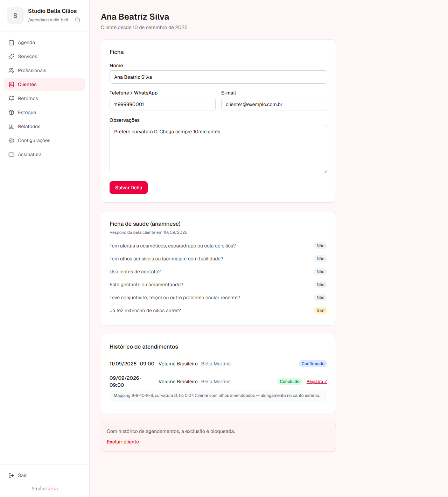
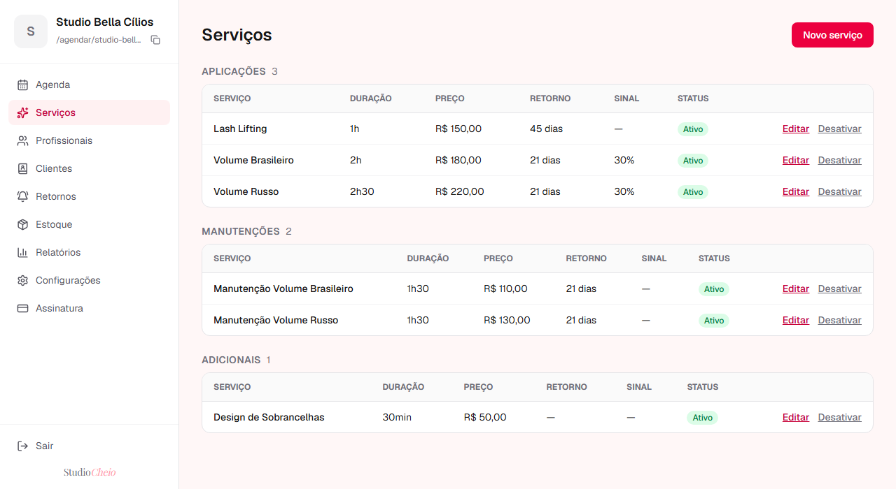

# StudioCheio

SaaS multi-tenant de gestão para negócios de estética e beleza. **Em produção, com estabelecimentos reais operando a agenda no dia a dia.**

> Repositório de vitrine técnica. O código-fonte é fechado porque a aplicação processa dados pessoais de consumidores finais (agenda, cadastro, ficha de saúde, movimentação financeira) e o acesso restrito faz parte do controle desses dados.

---

## O problema

Salões, clínicas de estética e profissionais autônomos operam com ferramentas fragmentadas: agenda no caderno ou no WhatsApp, financeiro em planilha, estoque na memória, cadastro de cliente espalhado entre o celular e o Instagram.

As plataformas do mercado resolvem bem a agenda e param aí. O resto continua fora do sistema, e o profissional acaba operando em dois ou três lugares ao mesmo tempo.

## A solução

Um sistema único onde o negócio inteiro roda:

- **Agendamento online** — página pública própria por estabelecimento, onde a cliente marca sozinha, sem instalar app nem criar conta
- **Agenda** — grade por profissional e serviço, com tratamento de conflito de horário, bloqueios e remarcação preservando histórico
- **Ficha da cliente** — cadastro, histórico de atendimentos, registro técnico por visita e anamnese digital respondida no próprio agendamento
- **Retorno de manutenção** — o sistema identifica quem está no prazo de voltar e monta a mensagem de retomada
- **Sinal via Pix** — serviços que exigem sinal reservam o horário por um prazo configurável até a confirmação do pagamento
- **Cupons de desconto** — códigos com validade e limite de usos, aplicados pela cliente no agendamento
- **Relatórios** — faturamento, ticket médio, receita prevista e faltas, com detalhamento por serviço e por profissional
- **Estoque de insumos** — controle por produto e tamanho, com alerta de reposição

Cada estabelecimento é um tenant isolado dentro da mesma aplicação, com página pública própria de agendamento.

## Capturas

| Agenda do dia | Relatórios |
|---|---|
|  |  |

| Página pública de agendamento | Estoque de insumos |
|---|---|
|  |  |

| Ficha da cliente | Catálogo de serviços |
|---|---|
|  |  |

> Dados fictícios — ambiente de demonstração.


## Stack

| Camada | Tecnologia |
|---|---|
| Framework | Next.js 16 (App Router) |
| UI | React 19, TypeScript, Tailwind CSS 4 |
| Backend | Server Actions do Next — sem API separada |
| Banco | PostgreSQL 17 (Supabase), RLS ativo |
| Auth | Supabase Auth |
| Arquivos | Supabase Storage |
| Validação | Zod |
| E-mail transacional | Resend |
| Hospedagem | Vercel + Supabase |

Schema versionado em 17 migrations, com tipos TypeScript gerados a partir do banco. Painel administrativo e página pública de agendamento compartilham o mesmo motor de regras, o que elimina a classe de bug em que as duas interfaces divergem.

## Decisões técnicas

### Isolamento entre estabelecimentos: quatro camadas

Multi-tenancy em banco único, defendido em profundidade em vez de depender de um filtro na aplicação:

1. **Row Level Security** nas 10 tabelas de domínio, com 12 policies apoiadas em funções `security definer`. Nenhuma consulta enxerga linha de outro tenant, independentemente do que a aplicação peça.
2. **Chaves estrangeiras compostas `(tenant_id, id)`.** Isso faz o próprio banco rejeitar o cruzamento de dados entre estabelecimentos — por exemplo, vincular um agendamento do salão A a um serviço do salão B — mesmo em escrita com papel privilegiado, onde a RLS não se aplica.
3. **Grants por coluna.** O dono do estabelecimento não consegue alterar campos que não são dele, incluindo o próprio plano.
4. **Papel `anon` sem grant algum.** A página pública de agendamento é renderizada no servidor, com `tenant_id` explícito em cada consulta. Não existe superfície anônima falando direto com o banco.

O raciocínio: filtro por `tenant_id` na aplicação é uma linha de defesa só, e vazamento entre tenants é o erro que encerra um SaaS. Cada camada aqui cobre uma falha diferente — bug de aplicação, escrita privilegiada, escalonamento de privilégio do próprio usuário e exposição pública.

### Conflito de agendamento: três camadas, uma delas é a que vale

1. **Motor de disponibilidade puro** monta os horários livres a partir de `expediente − agendamentos − bloqueios`. Sendo função pura, é testável isoladamente e não conversa com o banco.
2. **Revalidação no servidor** antes de gravar, o que barra POST forjado e tela desatualizada.
3. **Constraint `EXCLUDE USING gist` sobre `tstzrange`**, que torna a sobreposição fisicamente impossível no PostgreSQL.

Duas clientes clicando no mesmo segundo: uma grava, a outra recebe aviso claro e a lista recarregada.

A camada 3 é a única que resolve condição de corrida de verdade. As camadas 1 e 2 existem para que o usuário nunca chegue até ela — validar só no banco funcionaria, mas devolveria erro em vez de experiência.

```sql
ALTER TABLE agendamentos
  ADD CONSTRAINT chk_sem_sobreposicao
  EXCLUDE USING gist (
    profissional_id WITH =,
    tstzrange(data_hora_inicio, data_hora_fim, '[)') WITH &&
  ) WHERE (status IN ('pendente', 'confirmado', 'concluido'));
```

Dois detalhes que essa constraint carrega:

- O intervalo `[)` é fechado no início e aberto no fim, então um atendimento que termina às 15:00 e outro que começa às 15:00 **não** conflitam.
- O `WHERE` a torna parcial: cancelado e falta liberam o horário, enquanto reserva aguardando pagamento de sinal continua segurando o slot.

### Deploy com clientes atendendo

Nada vai direto para o `main`. O fluxo é branch, validação no preview da Vercel e só então merge — produção segue rodando o código anterior até o último momento.

**Migrations são sempre aditivas:** coluna nova nasce anulável e é invisível para o código que está no ar. Isso é o que torna o rollback de um clique realmente seguro; com migration destrutiva, voltar o código deixaria a aplicação antiga incompatível com o schema novo. Alteração ou remoção de coluna vai em duas etapas, em deploys separados.

Backup automático semanal do banco, com retenção de 90 dias — código volta fácil, dado de cliente não.

Não há banco de staging. A validação é feita em um estabelecimento de testes dentro do próprio ambiente. É uma limitação assumida: um banco espelho é o próximo passo quando o volume justificar o custo.


---

**Vinicius Coimbra** — Desenvolvedor Full Stack
[LinkedIn](https://www.linkedin.com/in/viniciuscoimbradev) · [GitHub](https://github.com/Vcoimbra1)
